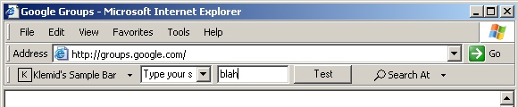



## Internet Explorer Toolbar \(revised\)

### Description

Download this revised version of my well-known IE toolbar. It now supports multiple different controls like textbox, button and combobox. This required the focus handling to be totally revised.

Additionally it now makes use of my Log4VB, which gives you a perfect view on what happens in your component. Unfortunalety I found no way to far to upload the compiled version reference in the binary compatibility. This causes some unconvenience during compilation. You may visit my homepage to avoid this. 

----

The former description was: 

----

You want to have your own IE toolbar like Google or eBay? Writing Explorer Toolbar with pure VB seems to be one of the last challenges in the VB world. I tried hard and I guess came a step further compared to Eduardo Morcillo's 'Shell Extension' code. The main difficulty is that the CoolBar in the Common Control ActiveX component doesn't support variable-length buttons, which makes it more or less useless for an Explorer toolbar implementation. This forces you to use API calls to create the toolbar. Eduardo's go-ahead was to create the textbox on the toolbar via an API call as well. I wanted to avoid this because this makes it more difficult to handle events and set attributes of the textbox. My code re-uses a textbox, a button and a comboboxfrom a VB form. Additionally it takes the dropdown menus associated with the two toolbar buttons from the same VB form. Another difficulty was to handle certain accelerator keys like Backspace within the toolbar. I found a simpler solution for this compared to Eduardo's code.

The toolbar has a very simple functionality. I simply wants to show how you can build one with as much VB as possible.

For more recent and more enhanced versions of the toolbar please visit my homepage www.klemid.de.

The VB project makes use of Edanmo's OLELIB.TLB. To avoid a version hell please download the typelib stuff directly from Edanmo's site (http://www.mvps.org/emorcillo/). The typelib is only required when you want to recompile the VB project. +++

The code was developed under Window XP / IE6. I tested if hasty under W2K/IE5 and Win98 SE/IE5.5 and it worked as well.
 
### More Info
 

             |
---                |---
**Submitted On**   |2004-11-29 00:42:04
**By**             |[Klemens Schmid](https://github.com/Planet-Source-Code/PSCIndex/blob/master/ByAuthor/klemens-schmid.md)
**Level**          |Advanced
**User Rating**    |4.9 (34 globes from 7 users)
**Compatibility**  |VB 6\.0
**Category**       |[Internet/ HTML](https://github.com/Planet-Source-Code/PSCIndex/blob/master/ByCategory/internet-html__1-34.md)
**World**          |[Visual Basic](https://github.com/Planet-Source-Code/PSCIndex/blob/master/ByWorld/visual-basic.md)
**Archive File**   |[Internet\_E18306912182004\.zip](https://github.com/Planet-Source-Code/klemens-schmid-internet-explorer-toolbar-revised__1-56659/archive/master.zip)

